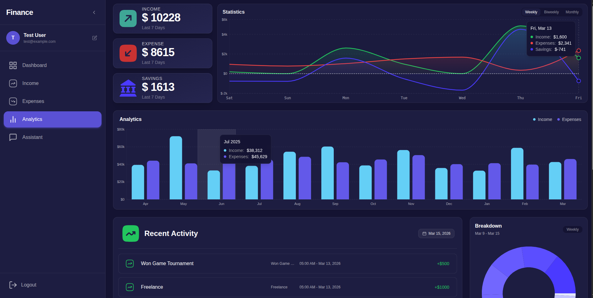
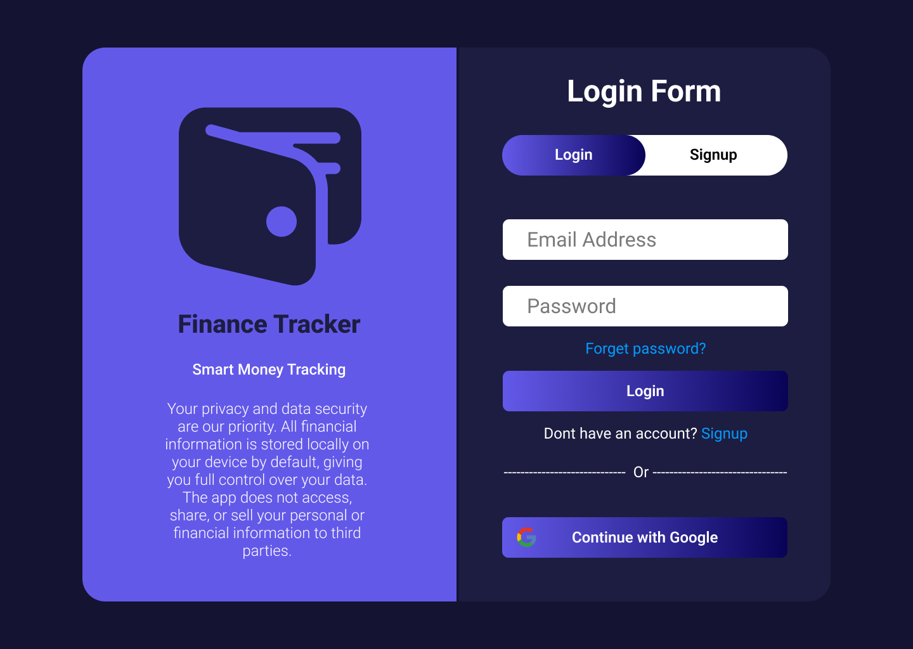
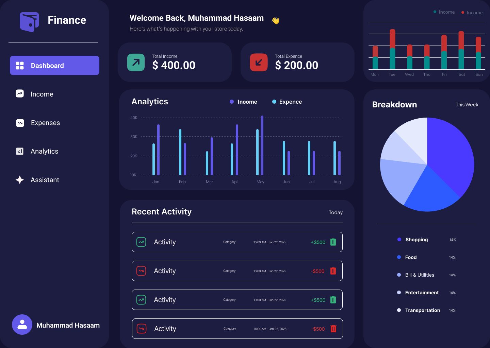

# Finance Tracker

> **Public Repository** - This is the public reference version of Finance Tracker.
> Active development takes place in a private repository. This repo is kept in sync with cleaned-up, production-ready snapshots.

A full-stack personal finance tracking app built with NestJS, Next.js, PostgreSQL, and Redis.

## Public Demo

Check out the live public version of Finance Tracker here:

[](https://m-hasaam.github.io/FinanceTracker-public/analytics)

https://m-hasaam.github.io/FinanceTracker-public/analytics

> **Note:** This is a **frontend prototype** using dummy JSON data for showcase purposes.  
> It does **not** include a real backend or live database. To access full functionality, run the project locally using the guide below.

<div align="center">
  
</div>

## Design Preview

View the UI design on Figma:

[](https://www.figma.com/design/DhPCiphvnSKwBA5Zlrogai/Finance-Tracker?t=WVw2XH7OPthWufiL-1)

https://www.figma.com/design/DhPCiphvnSKwBA5Zlrogai/Finance-Tracker?t=WVw2XH7OPthWufiL-1

<div align="center">
  
  
</div>

## Prerequisites

> This project requires Ubuntu or WSL Ubuntu (Windows Subsystem for Linux).
> If you are on Windows, install WSL with Ubuntu before continuing:
> https://learn.microsoft.com/en-us/windows/wsl/install

### 1. Install Flox (Ubuntu / Debian)

Flox manages the entire dev environment (Node.js, Bun, PostgreSQL, Redis) declaratively via `.flox/env/manifest.toml`.

#### 1.1 Download the Flox package

```bash
wget https://downloads.flox.dev/by-env/stable/deb/flox.x86_64-linux.deb
```

#### 1.2 Install Flox

```bash
sudo apt install ./flox.x86_64-linux.deb
```

#### 1.3 Verify installation

```bash
flox --version
```

Expected output:

```text
1.10.0
```

Restart your terminal or run:

```bash
source ~/.bashrc
```

Full install docs: https://flox.dev/docs/install-flox/

---

## Configuration

Before activating the environment, create a local `.env` file from `.env.example` and then replace every placeholder value with your own secrets:

```bash
cp .env.example .env
```

| Variable | Where to get it |
| --- | --- |
| `GOOGLE_CLIENT_ID` | Google Cloud Console -> Credentials -> OAuth 2.0 Client ID |
| `GOOGLE_CLIENT_SECRET` | Same OAuth 2.0 client as above |
| `GOOGLE_REDIRECT_URI` | Use `http://localhost:3001/auth/google/callback` for local development |
| `INTERNAL_JWT_SECRET` | Any random 32-character string, for example `openssl rand -hex 16` |
| `PGDATABASE` | Any name you want for the local PostgreSQL database |

After editing your environment values, reactivate Flox so the lockfile and environment are refreshed:

```bash
flox activate
```

Never commit real secrets.

---

## Setup

### 2. Activate Flox Environment

This installs all required tools and initializes PostgreSQL and Redis on first run:

```bash
flox activate
```

### 3. Start Services

Start PostgreSQL and Redis:

```bash
flox services start
```

### 4. Generate Prisma Client

Required for the `@repo/database` package to resolve correctly:

```bash
cd packages/database
bun run db:migrate:dev
bun run generate
cd ../..
```

### 5. Start Development Servers

```bash
bun run dev
```

- Frontend: http://localhost:3000
- Backend API: http://localhost:3001

### 6. Open Prisma Studio (Optional)

```bash
bun run studio
```

- Prisma Studio: http://localhost:51212/

---

## Troubleshooting

### `File '@repo/typescript-config/nextjs.json' not found`

This usually means the TypeScript language server in VS Code has a stale cache even though workspace links are correct.

Fix:

1. Open any `.tsx` file in the project.
2. Open the Command Palette with `Ctrl+Shift+P` or `Cmd+Shift+P`.
3. Run `TypeScript: Restart TS Server`.

If the error persists, reinstall dependencies to refresh workspace symlinks.

---

## Common Scripts

| Command | Description |
| --- | --- |
| `bun run dev` | Start all dev servers |
| `bun run build` | Build all apps and packages |
| `bun run test` | Run unit tests |
| `bun run test:e2e` | Run end-to-end tests |
| `bun run lint` | Lint all packages |
| `bun run format` | Format code |

---

## Flox Environment

`flox activate` automatically:

- Installs PostgreSQL, Redis, Node.js 20, and Bun
- Initializes a local PostgreSQL database on first run
- Sets `DATABASE_URL` and `REDIS_URL` environment variables
- Configures all required paths

Run `flox services logs` if you need to inspect service status or connection issues.

---

## Project Structure

```text
apps/
  api/      # NestJS backend
  web/      # Next.js frontend
packages/
  database/ # Prisma schema and client
  ui/       # Shared React component library
  *-config/ # Shared ESLint, TypeScript, and Jest configs
```

---

## Notes About This Public Repo

- Active development happens in a private repository.
- This repository is intended as a public reference snapshot.
- Secrets, deployment credentials, and other private operational details are intentionally excluded.
